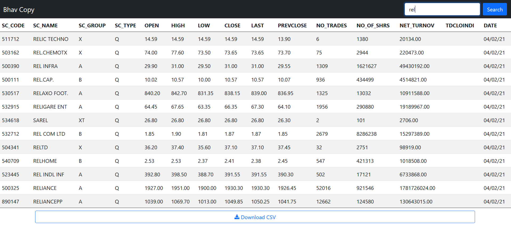

# Bhav Copy
- Django webapp which downloads bhavcopy from BSE's website daily. 
- Vue frontend where entries can be searched and exported to a CSV file.
- Redis is used for data storing and celery beat for task scheduling.

## Screenshot


## Setup Instructions
Clone the repository:
```
git clone https://github.com/lixxz/BhavCopy.git
cd Bhavcopy/
```

Create and activate virtualenv:
```
python3 -m venv venv
source venv/bin/activate
```

Install the dependencies:
```
pip install -r requirements.txt
```

Install and start redis(for ubuntu):
```
sudo apt install redis-server
redis-server --port 6379
```

Start the celery beat scheduler and worker:
```
celery -A bhavcopy worker -B
```

Run the django server:
```
python manage.py runserver 8000
```
App should be accessible now at http://localhost:8000